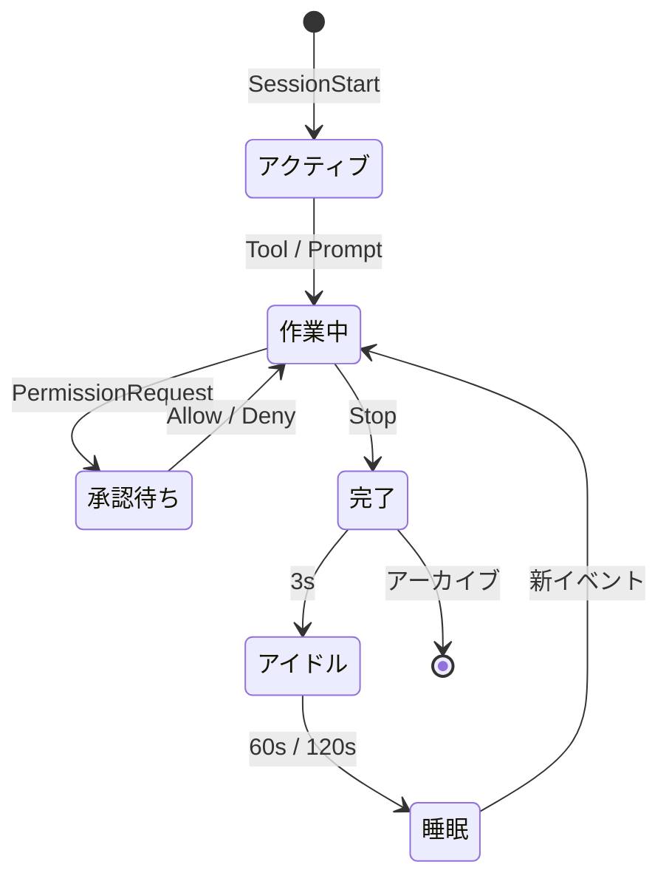

<p align="center">
  
</p>

<h1 align="center">Notchikko</h1>

<p align="center"><em>島のいきもの：見上げれば、そこに優しさを。</em></p>

<p align="center">
  <a href="README.md">English</a> ·
  <a href="README.zh-CN.md">简体中文</a> ·
  <a href="README.zh-TW.md">繁體中文</a> ·
  <strong>日本語</strong> ·
  <a href="README.ko.md">한국어</a>
</p>

画面の上端にあるノッチは、長らく注意して避けるべき暗い禁地でしかありませんでした。Notchikko はそこを小さな島に変え、一匹の小さな生き物を住まわせます —— あなたが Agent を呼び出すと深く考え込み、ツールが呼ばれると慌ただしく動き、タスクが完了するとそっと喜ぶ。長く戻ってこなければ、尻尾をしまって島の片隅で居眠りを始めます。見上げれば、そこに彼はいます。

Notchikko は AI Agent が何をしているかを理解します。インストール済みの CLI を嗅ぎつけ、そっとあなたに尋ねます ——「フックをつないでもよいですか？」その後はすべて彼が伝えます。セッション開始、ツール呼び出し、タスク完了、エラー、一時停止 —— あらゆる動きが島の小さな生き物の一挙手一投足に映し出されます。画面の上には、常に生気があります。

## アニメーション状態

Notchikko は hook イベントによってリアルタイムに 11 種類の状態を切り替えます。各状態には複数の SVG バリアントを含めることができ、遷移時にランダムに選ばれます —— 以下の表は各状態のトリガー元と代表的な姿を示します。

<table>
  <tr>
    <td align="center" width="120"><br><sub><b>アイドル</b></sub><br><sub>無活動</sub></td>
    <td align="center" width="120"><br><sub><b>読み込み</b></sub><br><sub>Read / Grep / Glob</sub></td>
    <td align="center" width="120"><br><sub><b>入力</b></sub><br><sub>Edit / Write / NotebookEdit</sub></td>
    <td align="center" width="120"><br><sub><b>ビルド</b></sub><br><sub>Bash</sub></td>
  </tr>
  <tr>
    <td align="center" width="120"><br><sub><b>思考</b></sub><br><sub>LLM 生成中</sub></td>
    <td align="center" width="120"><br><sub><b>整理</b></sub><br><sub>コンテキスト圧縮</sub></td>
    <td align="center" width="120"><br><sub><b>喜び</b></sub><br><sub>タスク完了</sub></td>
    <td align="center" width="120"><br><sub><b>エラー</b></sub><br><sub>ツールエラー</sub></td>
  </tr>
  <tr>
    <td align="center" width="120"><br><sub><b>睡眠</b></sub><br><sub>長時間アイドル</sub></td>
    <td align="center" width="120"><br><sub><b>承認</b></sub><br><sub>PermissionRequest</sub></td>
    <td align="center" width="120"><br><sub><b>ドラッグ</b></sub><br><sub>ユーザー操作</sub></td>
    <td align="center" width="120"><sub>テーマパックには更にバリアントが</sub></td>
  </tr>
</table>

## セッション挙動

各 agent セッションは `SessionStart` で Notchikko の視界に入り、ツール呼び出し・思考・承認・エラー・完了の間を流れ、最終的に `Stop` イベントでアーカイブされます。アイドルと睡眠はタイマーが引き継ぎます。ライフサイクルは以下の通り：



承認バブルは 4 つのアクションを提供します：一度だけ許可、常に許可、このセッションは自動承認、拒否。Claude Code の `AskUserQuestion` は識別され、クリック可能な選択肢としてレンダリングされます。

Notchikko は最大 32 セッションを同時にマウントし、エージェント間で共有、超過分は LRU で淘汰されます。小さな生き物をクリックすると現在のセッションが動くターミナルにフォーカスし、右クリックメニューから任意のセッションをピン留め・ジャンプ・クローズできます。トークン使用量はメニューバーに同期表示されます。

## 対応と制限

### CLI 対応

| CLI | Hook 統合 | 承認バブル | ターミナルジャンプ | トークン使用量 | ステータス |
| --- | :---: | :---: | :---: | :---: | --- |
| **Claude Code** | ✓ | ✓ | ✓ | ✓ | 完全対応 |
| **OpenAI Codex CLI** | ✓ | ✓ | ✓ | — | 完全対応 |
| **Gemini CLI** | ✓ | ✓ | ✓ | — | 完全対応 |
| **Trae CLI** | ✓ | ✓ | ✓ | — | 完全対応 |
| Cursor Agent | — | — | — | — | 計画中 |
| GitHub Copilot CLI | — | — | — | — | 計画中 |
| opencode | — | — | — | — | 計画中 |

✓ は対応済み、— は未対応です。トークン使用量は現在 Claude Code の transcript からのみ取得可能です。他のエージェントが同等のフィールドを公開し次第、追従していきます。

### ターミナルフォーカス

| ターミナル | フォーカス精度 |
| --- | --- |
| iTerm2 | Tab |
| Terminal.app | Tab |
| Ghostty | Tab |
| Kitty | Window |
| VS Code | Tab |
| VS Code Insiders | Tab |
| Cursor | Tab |
| Windsurf | Tab |
| その他のターミナル | アプリ |

## インストールと実行

Notchikko には macOS 14.0 以上が必要です。

### ダウンロード

[Releases](https://github.com/yangjie-layer/Notchikko/releases) から最新の署名・公証済み `.dmg` をダウンロードし、`/Applications` にドラッグして起動してください。初回起動時、Notchikko はインストール済みの AI CLI を自動検出し、必要に応じて hook のインストールを案内します。

### ソースからビルド

依存：Xcode 15 以上、Swift 5；外部依存の [Sparkle](https://github.com/sparkle-project/Sparkle) は SPM で取り込み済みです。

```bash
git clone https://github.com/yangjie-layer/Notchikko.git
cd Notchikko
xcodebuild -scheme Notchikko -configuration Debug build
```

または Xcode で `Notchikko.xcodeproj` を開き、`Notchikko` スキームを直接実行してください。

## カスタムテーマ

Notchikko は組み込みキャラクターの完全な差し替えに対応しています。SVG 一式を状態ごとのディレクトリに分けて `~/.notchikko/themes/<your-theme>/` に置いてください：

```
~/.notchikko/themes/my-theme/
├── theme.json
├── idle/idle.svg
├── reading/reading.svg
├── typing/typing.svg
├── ...
└── sounds/        # オプション：状態ごとの短い効果音
```

各状態ディレクトリには複数のバリアントを含めることができ、Notchikko は遷移ごとにランダムで 1 つを選びます。外部 SVG は自動的にサニタイズされ（`<script>`、`javascript:` などの危険な内容は除去）、1 ファイルあたり 1 MB を上限とします。

## 謝辞とライセンス

**Clawd キャラクターのデザインは [Anthropic](https://www.anthropic.com) に帰属します。** 本プロジェクトは非公式の作品で、Anthropic とは公式な関係はありません。自動アップデートは [Sparkle](https://github.com/sparkle-project/Sparkle) に依存しています。

ソースコードは MIT ライセンスで公開しています。詳細は [LICENSE](LICENSE) を参照してください。`assets/` と `Notchikko/Resources/themes/` 配下の**アートワークは MIT ライセンスの対象外**です。許可なく再配布しないでください。
