<p align="center">
  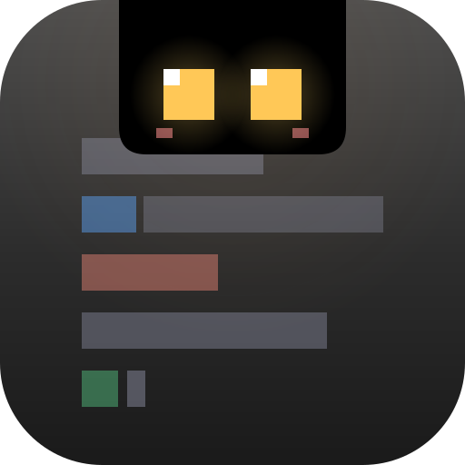
</p>

<h1 align="center">Notchikko</h1>

<p align="center"><em>島のいきもの：見上げれば、そこに優しさを。</em></p>

<p align="center">
  <a href="README.md">English</a> ·
  <a href="README.zh-CN.md">简体中文</a> ·
  <a href="README.zh-TW.md">繁體中文</a> ·
  <strong>日本語</strong> ·
  <a href="README.ko.md">한국어</a>
</p>

画面の上端にあるノッチは、長らく注意して避けるべき暗い禁地でしかありませんでした。Notchikko（ノッチッコ）はそこを小さな島に変え、Notchikko をそこに住まわせます —— あなたが Agent を呼び出すと深く考え込み、ツールが呼ばれると慌ただしく動き、タスクが完了するとそっと喜ぶ。長く戻ってこなければ、尻尾をしまって島の片隅で居眠りを始めます。見上げれば、そこに彼はいます。Notchikko は AI Agent が何をしているかを理解します。インストール済みの CLI を嗅ぎつけ、そっとあなたに尋ねます ——「フックをつないでもよいですか？」その後はすべて彼が伝えます。セッション開始、ツール呼び出し、タスク完了、エラー、一時停止 —— あらゆる動きが島の Notchikko の一挙手一投足に映し出されます。画面の上には、常に生気があります。

## アニメーション状態

Notchikko には 12 種類のアニメーション状態があります —— 11 種類は hook イベントで、1 種類はマウス操作で駆動されます。各状態には複数の SVG バリアントを含めることができ、遷移時にランダムに選ばれます —— 以下の表は各状態のトリガー元と代表的な姿を示します。マウスでそっと撫でると頬にほんのり朱が差し、トラックパッドが心拍のように震え、`×N` のコンボカウンタがノッチの縁を流れていきます。そっと引っ張れば、目に星を散らしながらふらふらとこの小さな世界を漂います。

<table>
  <tr>
    <td align="center" width="120"><br><sub><b>アイドル</b></sub><br><sub>無活動</sub></td>
    <td align="center" width="120"><br><sub><b>読み込み</b></sub><br><sub>Read / Grep / Glob</sub></td>
    <td align="center" width="120"><br><sub><b>入力</b></sub><br><sub>Edit / Write / NotebookEdit</sub></td>
    <td align="center" width="120"><br><sub><b>ビルド</b></sub><br><sub>Bash</sub></td>
    <td align="center" width="120">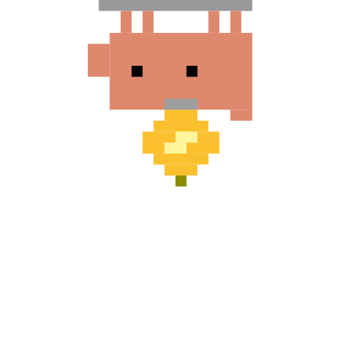<br><sub><b>思考</b></sub><br><sub>LLM 生成中</sub></td>
  </tr>
  <tr>
    <td align="center" width="120"><br><sub><b>整理</b></sub><br><sub>コンテキスト圧縮</sub></td>
    <td align="center" width="120"><br><sub><b>喜び</b></sub><br><sub>タスク完了</sub></td>
    <td align="center" width="120"><br><sub><b>エラー</b></sub><br><sub>ツールエラー</sub></td>
    <td align="center" width="120"><br><sub><b>睡眠</b></sub><br><sub>長時間アイドル</sub></td>
    <td align="center" width="120"><br><sub><b>承認</b></sub><br><sub>PermissionRequest</sub></td>
  </tr>
  <tr>
    <td align="center" width="120"><br><sub><b>ドラッグ</b></sub><br><sub>ユーザー操作</sub></td>
    <td align="center" width="120"><br><sub><b>なでなで</b></sub><br><sub>マウスで往復</sub></td>
    <td align="center" width="120"><sub><b>???</b></sub><br><sub>隠しイースターエッグ — 自分で見つけてみて</sub></td>
    <td align="center" width="120"><sub><b>近日公開</b></sub><br><sub>他のインタラクション…</sub></td>
    <td align="center" width="120"></td>
  </tr>
</table>

## セッション挙動

各 Agent セッションは `SessionStart` で Notchikko の視界に入り、ツール呼び出し・思考・承認・エラー・完了の間を流れ、最終的に `Stop` イベントでアーカイブされます。アイドルと睡眠はタイマーが引き継ぎます。
Notchikko は最大 32 セッションを同時にマウントし、エージェント間で共有、超過分は LRU で淘汰されます。Notchikko をクリックすると現在のセッションが動くターミナルにフォーカスし、右クリックメニューから任意のセッションをピン留め・ジャンプ・クローズできます。トークン使用量はメニューバーに同期表示されます。

Agent から `PermissionRequest` が届くと、ノッチの下に承認バブルが漂い出て、4 つのアクションを提示します：

- **一度だけ許可**：今回の呼び出しのみを通します。次に Agent が動こうとしたらまた確認します。一度きりの破壊的操作に向いています。
- **常に許可**：今回を通し、さらにこのツールを現在のプロジェクトの `settings.local.json` に書き込みます（hook の `addRules` 経由）。以降このプロジェクトでは同じツールを確認なしで呼び出せ、セッションをまたいで有効です。
- **このセッションを自動承認**：現在のセッションを `bypassPermissions` モード（`--dangerously-skip-permissions` 相当）に切り替え、同じセッション内で保留中の他の承認リクエストもまとめて通します。セッション終了まで有効です。
- **拒否**：今回のリクエストを却下し、「Denied by Notchikko」を理由として Agent に返します。

Claude Code 独自の `AskUserQuestion` も同じ承認バブルを通りますが、許可/拒否ボタンではなく、Notchikko が選択肢をクリック可能なチップとして表示します。タップすると答えがそのまま Agent に返され、作業が続きます。

ライフサイクルは以下の通り：

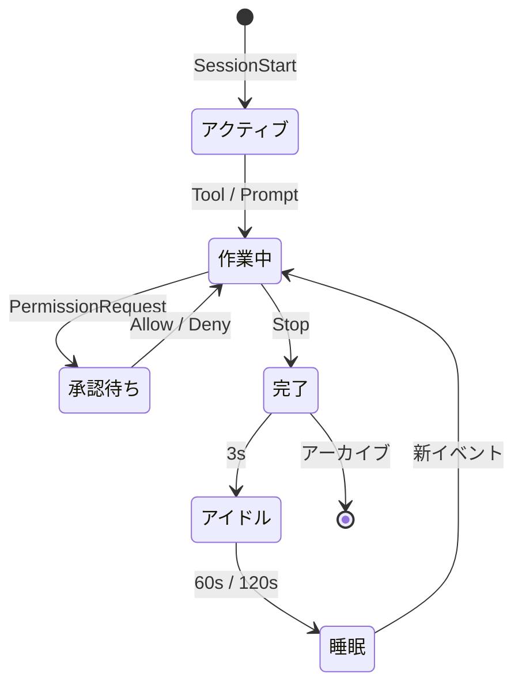

## 対応と制限

下の表は CLI 統合と端末フォーカス精度を一つにまとめたものです。Hook / 承認 / ジャンプ / トークンの可否は CLI 側が決め、ジャンプがタブ・ウィンドウ・アプリのどこまで精度が及ぶかは端末側が決めます。

<table>
  <thead>
    <tr>
      <th align="left">コンポーネント</th>
      <th align="center">Hook</th>
      <th align="center">承認</th>
      <th align="center">ジャンプ</th>
      <th align="center">トークン</th>
      <th align="center">フォーカス精度</th>
      <th align="left">ステータス</th>
    </tr>
  </thead>
  <tbody>
    <tr><td colspan="7"><sub><b>CLI</b></sub></td></tr>
    <tr><td><b>Claude Code</b></td><td align="center">✓</td><td align="center">✓</td><td align="center">✓</td><td align="center">✓</td><td align="center">—</td><td>完全対応</td></tr>
    <tr><td><b>OpenAI Codex CLI</b></td><td align="center">✓</td><td align="center">✓</td><td align="center">✓</td><td align="center">—</td><td align="center">—</td><td>完全対応</td></tr>
    <tr><td><b>Gemini CLI</b></td><td align="center">✓</td><td align="center">✓</td><td align="center">✓</td><td align="center">—</td><td align="center">—</td><td>完全対応</td></tr>
    <tr><td><b>Trae CLI</b></td><td align="center">✓</td><td align="center">✓</td><td align="center">✓</td><td align="center">—</td><td align="center">—</td><td>完全対応</td></tr>
    <tr><td>Cursor Agent</td><td align="center">—</td><td align="center">—</td><td align="center">—</td><td align="center">—</td><td align="center">—</td><td>計画中</td></tr>
    <tr><td>GitHub Copilot CLI</td><td align="center">—</td><td align="center">—</td><td align="center">—</td><td align="center">—</td><td align="center">—</td><td>計画中</td></tr>
    <tr><td>opencode</td><td align="center">—</td><td align="center">—</td><td align="center">—</td><td align="center">—</td><td align="center">—</td><td>計画中</td></tr>
    <tr><td colspan="7"><sub><b>ターミナル</b></sub></td></tr>
    <tr><td>iTerm2</td><td colspan="4" align="center">—</td><td align="center">Tab</td><td></td></tr>
    <tr><td>Terminal.app</td><td colspan="4" align="center">—</td><td align="center">Tab</td><td></td></tr>
    <tr><td>Ghostty</td><td colspan="4" align="center">—</td><td align="center">Tab</td><td></td></tr>
    <tr><td>Kitty</td><td colspan="4" align="center">—</td><td align="center">Window</td><td></td></tr>
    <tr><td>VS Code / VS Code Insiders / Cursor / Windsurf</td><td colspan="4" align="center">—</td><td align="center">Tab</td><td></td></tr>
    <tr><td>その他のターミナル</td><td colspan="4" align="center">—</td><td align="center">App</td><td></td></tr>
  </tbody>
</table>

> ✓ は対応済み、— は非該当または未対応を表します。
> トークン使用量は現在 Claude Code の transcript からしか読み取れません。他のエージェントは同等のフィールドを公開し次第対応します。
> フォーカス精度「Tab」= 端末のタブまで、「Window」= ウィンドウまで、「App」= アプリ本体を起動するのみ。

## インストールと実行

Notchikko には macOS 14.0 以上が必要です。

### ダウンロード

[Releases](https://github.com/yangjie-layer/Notchikko/releases) から最新の署名・公証済み `.dmg` をダウンロードし、`/Applications` にドラッグして起動してください。初回起動時、Notchikko はインストール済みの AI CLI を自動検出し、必要に応じて hook のインストールを案内します。

### ソースからビルド

依存：Xcode 15 以上、Swift 5；外部依存の [Sparkle](https://github.com/sparkle-project/Sparkle) は SPM で取り込み済みです。

```bash
git clone https://github.com/yangjie-layer/Notchikko.git
cd Notchikko
xcodebuild -scheme Notchikko -configuration Debug build
```

または Xcode で `Notchikko.xcodeproj` を開き、`Notchikko` スキームを直接実行してください。

## カスタムテーマ

Notchikko は組み込みキャラクターの完全な差し替えに対応しています。SVG 一式を状態ごとのディレクトリに分けて `~/.notchikko/themes/<your-theme>/` に置いてください：

```
~/.notchikko/themes/my-theme/
├── theme.json
├── idle/idle.svg
├── reading/reading.svg
├── typing/typing.svg
├── ...
└── sounds/        # オプション：状態ごとの短い効果音
```

各状態ディレクトリには複数のバリアントを含めることができ、Notchikko は遷移ごとにランダムで 1 つを選びます。外部 SVG は自動的にサニタイズされ（`<script>`、`javascript:` などの危険な内容は除去）、1 ファイルあたり 1 MB を上限とします。

## 謝辞とライセンス

**Clawd キャラクターのデザインは [Anthropic](https://www.anthropic.com) に帰属します。** 本プロジェクトは非公式の作品で、Anthropic とは公式な関係はありません。自動アップデートは [Sparkle](https://github.com/sparkle-project/Sparkle) に依存しています。

ソースコードは MIT ライセンスで公開しています。詳細は [LICENSE](LICENSE) を参照してください。`assets/` と `Notchikko/Resources/themes/` 配下の**アートワークは MIT ライセンスの対象外**です。許可なく再配布しないでください。
