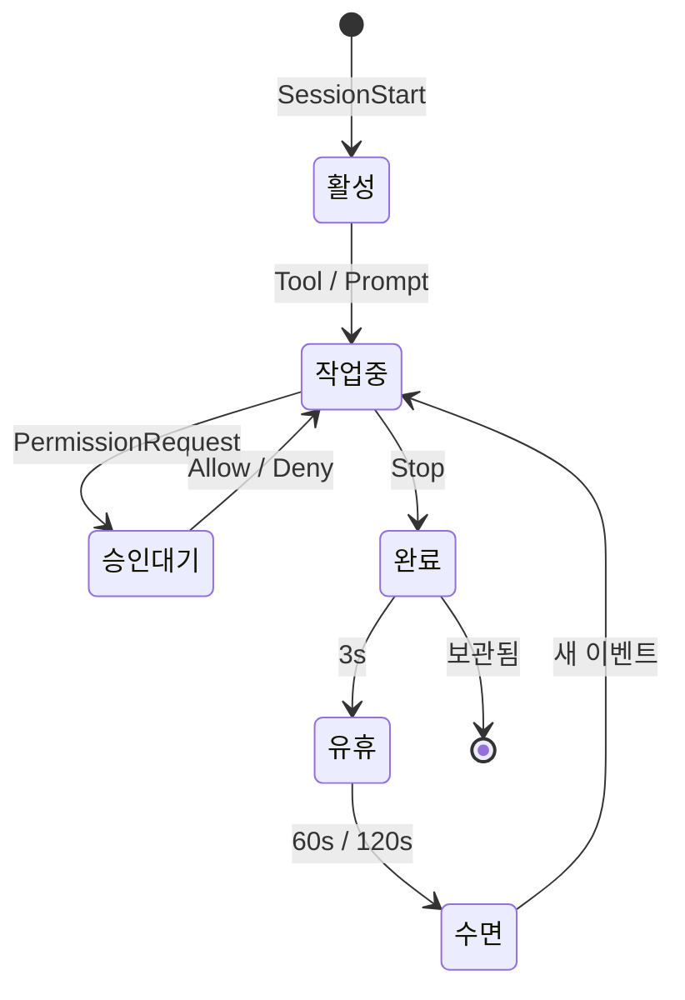

<p align="center">
  
</p>

<h1 align="center">Notchikko</h1>

<p align="center"><em>섬의 생물: 고개를 들면, 그곳에 다정함이.</em></p>

<p align="center">
  <a href="README.md">English</a> ·
  <a href="README.zh-CN.md">简体中文</a> ·
  <a href="README.zh-TW.md">繁體中文</a> ·
  <a href="README.ja.md">日本語</a> ·
  <strong>한국어</strong>
</p>

화면 위쪽의 노치 영역은 오랫동안 조심스레 피해야 하는 어두운 금단의 구역에 불과했습니다. Notchikko(노치코)는 이를 작은 섬으로 바꿔, 그 안에 Notchikko가 자리 잡게 합니다 —— 당신이 Agent를 부르면 골똘히 생각에 잠기고, 도구가 호출될 때면 분주히 움직이며, 작업이 완료되면 조용히 기뻐합니다. 그리고 당신이 오래 자리를 비우면 꼬리를 말고 섬 한구석에서 조용히 졸기 시작합니다. 고개를 들면, 그곳에 그가 있습니다. Notchikko는 AI Agent가 무엇을 하고 있는지 이해합니다. 설치된 CLI를 감지하고 조용히 묻습니다 —— "후크를 연결해 둘까요?" 그 이후로는 모든 것이 그를 통해 전달됩니다: 세션 시작, 도구 호출, 작업 완료, 오류, 일시 정지 —— 모든 움직임이 섬 위 Notchikko의 동작으로 매핑됩니다. 화면 위에는 언제나 생기가 흐릅니다.

## 애니메이션 상태

Notchikko는 12가지 애니메이션 상태를 가지고 있습니다 —— 11가지는 hook 이벤트로, 1가지는 마우스 인터랙션으로 트리거됩니다. 각 상태는 여러 개의 SVG 변형을 포함할 수 있으며, 진입 시 무작위로 선택됩니다 —— 아래 표는 각 상태의 트리거와 대표 모습을 보여줍니다. 마우스로 살며시 문지르면 수줍은 홍조가 번지고, 트랙패드가 심장 박동처럼 떨리며, `×N` 콤보 카운터가 노치 가장자리를 스쳐 지나갑니다. 살살 끌어당기면 눈에 별이 맴돌며 이 작은 세계를 어질어질하게 떠돕니다.

<table>
  <tr>
    <td align="center" width="120"><br><sub><b>유휴</b></sub><br><sub>활동 없음</sub></td>
    <td align="center" width="120"><br><sub><b>읽기</b></sub><br><sub>Read / Grep / Glob</sub></td>
    <td align="center" width="120"><br><sub><b>입력</b></sub><br><sub>Edit / Write / NotebookEdit</sub></td>
    <td align="center" width="120"><br><sub><b>빌드</b></sub><br><sub>Bash</sub></td>
    <td align="center" width="120"><br><sub><b>사고</b></sub><br><sub>LLM 생성 중</sub></td>
  </tr>
  <tr>
    <td align="center" width="120"><br><sub><b>정리</b></sub><br><sub>컨텍스트 압축</sub></td>
    <td align="center" width="120"><br><sub><b>기쁨</b></sub><br><sub>작업 완료</sub></td>
    <td align="center" width="120"><br><sub><b>오류</b></sub><br><sub>도구 오류</sub></td>
    <td align="center" width="120"><br><sub><b>수면</b></sub><br><sub>긴 유휴</sub></td>
    <td align="center" width="120"><br><sub><b>승인</b></sub><br><sub>PermissionRequest</sub></td>
  </tr>
  <tr>
    <td align="center" width="120"><br><sub><b>드래그</b></sub><br><sub>사용자 드래그</sub></td>
    <td align="center" width="120"><br><sub><b>쓰다듬기</b></sub><br><sub>마우스 왕복</sub></td>
    <td align="center" width="120"><sub><b>???</b></sub><br><sub>숨겨진 이스터에그 — 직접 찾아보세요</sub></td>
    <td align="center" width="120"><sub><b>출시 예정</b></sub><br><sub>더 많은 인터랙션…</sub></td>
    <td align="center" width="120"></td>
  </tr>
</table>

## 세션 동작

각 Agent 세션은 `SessionStart`로 Notchikko의 시야에 들어와, 도구 호출 / 사고 / 승인 / 오류 / 완료를 거쳐 마지막으로 `Stop` 이벤트로 보관됩니다. 유휴와 수면은 타이머가 담당합니다.
Notchikko는 최대 32개의 세션을 동시에 마운트하며, 에이전트 간에 공유됩니다. 초과분은 LRU로 정리됩니다. Notchikko를 클릭하면 현재 세션이 실행 중인 터미널로 포커스가 이동하고, 우클릭 메뉴에서 임의의 세션을 고정 / 점프 / 닫기 할 수 있습니다. 토큰 사용량은 메뉴바에 동기화 표시됩니다.

Agent에서 `PermissionRequest`가 도착하면 노치 아래에서 승인 버블이 떠오르며 네 가지 동작을 제공합니다:

- **한 번만 허용**: 이번 호출만 통과시키고, Agent가 다음에 다시 뭔가 하려고 하면 또 멈춰 물어봅니다. 일회성 파괴적 작업에 적합합니다.
- **항상 허용**: 이번에 허용하고, 해당 도구를 현재 프로젝트의 `settings.local.json`에 (hook의 `addRules`를 통해) 기록합니다. 이제부터 이 프로젝트에서 같은 도구를 호출할 때 다시 묻지 않으며, 세션 경계를 넘어 지속됩니다.
- **이 세션 자동 승인**: 현재 세션을 `bypassPermissions` 모드(`--dangerously-skip-permissions`와 동등)로 전환하고, 이 세션에 쌓여 있던 다른 대기 중인 승인 요청도 함께 통과시킵니다. 세션이 끝나면 해제됩니다.
- **거부**: 이번 요청을 거절하고, "Denied by Notchikko"를 사유로 Agent에게 반환합니다.

Claude Code 전용 `AskUserQuestion`도 동일한 승인 버블을 거치지만 허용/거부 버튼이 아니라, Notchikko가 선택지를 클릭할 수 있는 칩으로 표시합니다. 탭하면 답이 그대로 Agent에 전달되어 작업을 계속합니다.

라이프사이클은 다음과 같습니다:



## 지원과 제한

아래 표는 CLI 통합 정도와 터미널 포커스 정밀도를 하나로 합친 것입니다. Hook / 승인 / 점프 / 토큰 가능 여부는 CLI가 결정하고, 점프가 탭까지 가는지 윈도우까지 가는지 단순히 앱만 활성화하는지는 터미널이 결정합니다.

<table>
  <thead>
    <tr>
      <th align="left">구성 요소</th>
      <th align="center">Hook</th>
      <th align="center">승인</th>
      <th align="center">점프</th>
      <th align="center">토큰</th>
      <th align="center">포커스 정밀도</th>
      <th align="left">상태</th>
    </tr>
  </thead>
  <tbody>
    <tr><td colspan="7"><sub><b>CLI</b></sub></td></tr>
    <tr><td><b>Claude Code</b></td><td align="center">✓</td><td align="center">✓</td><td align="center">✓</td><td align="center">✓</td><td align="center">—</td><td>완전 지원</td></tr>
    <tr><td><b>OpenAI Codex CLI</b></td><td align="center">✓</td><td align="center">✓</td><td align="center">✓</td><td align="center">—</td><td align="center">—</td><td>완전 지원</td></tr>
    <tr><td><b>Trae CLI</b></td><td align="center">✓</td><td align="center">✓</td><td align="center">✓</td><td align="center">—</td><td align="center">—</td><td>완전 지원</td></tr>
    <tr><td>Gemini CLI</td><td align="center">—</td><td align="center">—</td><td align="center">—</td><td align="center">—</td><td align="center">—</td><td>계획 중</td></tr>
    <tr><td>Cursor Agent</td><td align="center">—</td><td align="center">—</td><td align="center">—</td><td align="center">—</td><td align="center">—</td><td>계획 중</td></tr>
    <tr><td>GitHub Copilot CLI</td><td align="center">—</td><td align="center">—</td><td align="center">—</td><td align="center">—</td><td align="center">—</td><td>계획 중</td></tr>
    <tr><td>opencode</td><td align="center">—</td><td align="center">—</td><td align="center">—</td><td align="center">—</td><td align="center">—</td><td>계획 중</td></tr>
    <tr><td colspan="7"><sub><b>터미널</b></sub></td></tr>
    <tr><td>iTerm2</td><td colspan="4" align="center">—</td><td align="center">Tab</td><td></td></tr>
    <tr><td>Terminal.app</td><td colspan="4" align="center">—</td><td align="center">Tab</td><td></td></tr>
    <tr><td>Ghostty</td><td colspan="4" align="center">—</td><td align="center">Tab</td><td></td></tr>
    <tr><td>Kitty</td><td colspan="4" align="center">—</td><td align="center">Window</td><td></td></tr>
    <tr><td>VS Code / VS Code Insiders / Cursor / Windsurf</td><td colspan="4" align="center">—</td><td align="center">Tab</td><td></td></tr>
    <tr><td>기타 터미널</td><td colspan="4" align="center">—</td><td align="center">App</td><td></td></tr>
  </tbody>
</table>

> ✓는 지원, —는 해당 없음 또는 아직 미지원을 의미합니다.
> 토큰 사용량은 현재 Claude Code의 transcript에서만 읽을 수 있으며, 다른 에이전트는 동등한 필드를 노출하면 대응하겠습니다.
> 포커스 정밀도 "Tab" = 터미널 탭까지 정확히, "Window" = 윈도우까지, "App" = 앱만 활성화.

## 설치 및 실행

Notchikko는 macOS 14.0 이상이 필요합니다.

### 설치 패키지 다운로드

[Releases](https://github.com/LLLLLayer/notchikko/releases)에서 서명 및 공증된 최신 `.dmg`를 다운로드하여 `/Applications`에 드래그한 후 실행하세요. 첫 실행 시 Notchikko는 설치된 AI CLI를 자동으로 감지하고 필요에 따라 hook 설치를 안내합니다.

### 소스에서 빌드

요구 사항: Xcode 15 이상, Swift 5; 외부 종속성 [Sparkle](https://github.com/sparkle-project/Sparkle)은 SPM으로 통합되어 있습니다.

```bash
git clone https://github.com/LLLLLayer/notchikko.git
cd Notchikko
xcodebuild -scheme Notchikko -configuration Debug build
```

또는 Xcode에서 `Notchikko.xcodeproj`를 열고 `Notchikko` 스킴을 직접 실행할 수 있습니다.

## 사용자 정의 테마

Notchikko는 내장 캐릭터의 전체 교체를 지원합니다. SVG 세트를 상태별 디렉터리로 나누어 `~/.notchikko/themes/<your-theme>/`에 넣으세요:

```
~/.notchikko/themes/my-theme/
├── theme.json
├── idle/idle.svg
├── reading/reading.svg
├── typing/typing.svg
├── ...
└── sounds/        # 선택 사항: 상태별 짧은 효과음
```

각 상태 디렉터리에는 여러 변형을 둘 수 있으며, Notchikko는 진입할 때마다 무작위로 하나를 선택합니다. 외부 SVG는 자동으로 정화되며(`<script>`, `javascript:` 등 위험한 내용은 제거됨), 파일당 1 MB를 초과할 수 없습니다.

## 감사 및 라이선스

**Clawd 캐릭터 디자인은 [Anthropic](https://www.anthropic.com)에 귀속됩니다.** 본 프로젝트는 비공식 작품이며 Anthropic과는 공식적인 관계가 없습니다. 자동 업데이트는 [Sparkle](https://github.com/sparkle-project/Sparkle)에 의존합니다.

소스 코드는 MIT 라이선스로 공개되며, 자세한 내용은 [LICENSE](LICENSE)를 참조하세요. `assets/` 및 `Notchikko/Resources/themes/` 아래의 **아트워크는 MIT 라이선스에 해당하지 않습니다** —— 허락 없이 재배포하지 말아주세요.
