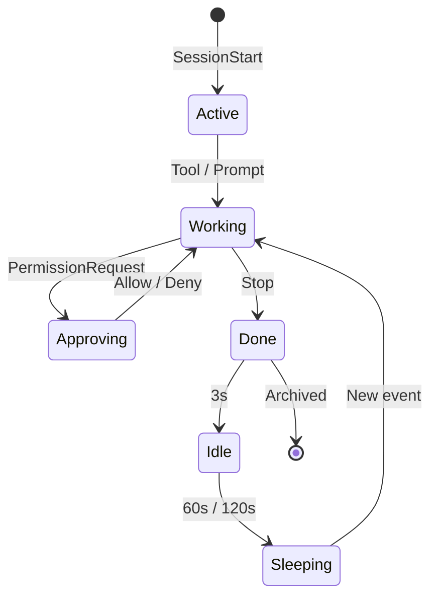

<p align="center">
  
</p>

<h1 align="center">Notchikko</h1>

<p align="center"><em>An island creature: every look upward, a quiet tenderness.</em></p>

<p align="center">
  <strong>English</strong> ·
  <a href="README.zh-CN.md">简体中文</a> ·
  <a href="README.zh-TW.md">繁體中文</a> ·
  <a href="README.ja.md">日本語</a> ·
  <a href="README.ko.md">한국어</a>
</p>

The notch at the top of your screen has long been a dark zone to be carefully avoided. Notchikko turns it into a tiny island, where a small creature settles in — pondering when you summon an Agent, scrambling when tools are called, quietly celebrating when a task completes; and when you've been gone too long, it tucks in its tail and dozes off in a corner of the island. Look up, and there it is.

Notchikko understands what AI Agents are doing. It sniffs out installed CLIs and asks gently — "Want to plug in their hooks?" From then on, everything flows through it: session start, tool calls, task completion, errors, pauses — every move maps to the small creature's gestures on the island. Above the screen, life always stirs.

## Animations

Notchikko drives 11 states in real time, triggered by hook events. Each state can include multiple SVG variants, picked at random on entry — the table below shows each state's trigger and a sample form.

<table>
  <tr>
    <td align="center" width="120"><br><sub><b>Idle</b></sub><br><sub>No activity</sub></td>
    <td align="center" width="120"><br><sub><b>Reading</b></sub><br><sub>Read / Grep / Glob</sub></td>
    <td align="center" width="120"><br><sub><b>Typing</b></sub><br><sub>Edit / Write / NotebookEdit</sub></td>
    <td align="center" width="120"><br><sub><b>Building</b></sub><br><sub>Bash</sub></td>
  </tr>
  <tr>
    <td align="center" width="120"><br><sub><b>Thinking</b></sub><br><sub>LLM generating</sub></td>
    <td align="center" width="120"><br><sub><b>Sweeping</b></sub><br><sub>Context compaction</sub></td>
    <td align="center" width="120"><br><sub><b>Happy</b></sub><br><sub>Task complete</sub></td>
    <td align="center" width="120"><br><sub><b>Error</b></sub><br><sub>Tool error</sub></td>
  </tr>
  <tr>
    <td align="center" width="120"><br><sub><b>Sleeping</b></sub><br><sub>Long idle</sub></td>
    <td align="center" width="120"><br><sub><b>Approving</b></sub><br><sub>PermissionRequest</sub></td>
    <td align="center" width="120"><br><sub><b>Dragging</b></sub><br><sub>User drag</sub></td>
    <td align="center" width="120"><sub>More variants tucked away in theme packs</sub></td>
  </tr>
</table>

## Session Behavior

Each agent session enters Notchikko's view via `SessionStart`, flows through tool calls, thinking, approval, errors, and completion, and is finally archived by `Stop`; idle and sleep are taken over by timers. The lifecycle:



Approval bubbles offer four actions: Allow Once, Always Allow, Auto Approve (this session), Deny; Claude Code's `AskUserQuestion` is recognized and rendered as clickable options.

Notchikko mounts up to 32 sessions concurrently, shared across agents, with LRU eviction beyond that. Click the creature to focus the terminal of the current session; right-click to pin, jump, or close any session. Token usage is shown in the menu bar.

## Support & Limitations

### CLI Support

| CLI | Hook | Approval | Terminal Jump | Token Usage | Status |
| --- | :---: | :---: | :---: | :---: | --- |
| **Claude Code** | ✓ | ✓ | ✓ | ✓ | Full |
| **OpenAI Codex CLI** | ✓ | ✓ | ✓ | — | Full |
| **Gemini CLI** | ✓ | ✓ | ✓ | — | Full |
| **Trae CLI** | ✓ | ✓ | ✓ | — | Full |
| Cursor Agent | — | — | — | — | Planned |
| GitHub Copilot CLI | — | — | — | — | Planned |
| opencode | — | — | — | — | Planned |

✓ supported, — not yet covered. Token usage is currently only readable from Claude Code's transcript; other agents will be picked up once they expose comparable fields.

### Terminal Focus

| Terminal | Focus Precision |
| --- | --- |
| iTerm2 | Tab |
| Terminal.app | Tab |
| Ghostty | Tab |
| Kitty | Window |
| VS Code | Tab |
| VS Code Insiders | Tab |
| Cursor | Tab |
| Windsurf | Tab |
| Other terminals | App |

## Install & Run

Notchikko requires macOS 14.0 or later.

### Download

Get the latest signed and notarized `.dmg` from [Releases](https://github.com/yangjie-layer/Notchikko/releases), drag it to `/Applications`, and launch. On first run, Notchikko detects installed AI CLIs and offers to install hooks as needed.

### Build from source

Requires Xcode 15+ and Swift 5; the external dependency [Sparkle](https://github.com/sparkle-project/Sparkle) is bundled via SPM.

```bash
git clone https://github.com/yangjie-layer/Notchikko.git
cd Notchikko
xcodebuild -scheme Notchikko -configuration Debug build
```

Or open `Notchikko.xcodeproj` in Xcode and run the `Notchikko` scheme directly.

## Custom Themes

Notchikko allows the built-in character to be fully replaced. Drop a set of SVGs into `~/.notchikko/themes/<your-theme>/`, organized by state:

```
~/.notchikko/themes/my-theme/
├── theme.json
├── idle/idle.svg
├── reading/reading.svg
├── typing/typing.svg
├── ...
└── sounds/        # optional: short audio per state
```

Each state directory may hold multiple variants — Notchikko picks one at random on each entry. External SVGs are sanitized (`<script>`, `javascript:`, and similar dangerous content are stripped), capped at 1 MB per file.

## Acknowledgments & License

**The Clawd character is the property of [Anthropic](https://www.anthropic.com).** This is an unofficial project, not affiliated with Anthropic. Auto-update is powered by [Sparkle](https://github.com/sparkle-project/Sparkle).

Source code is released under the MIT license — see [LICENSE](LICENSE). Artwork in `assets/` and `Notchikko/Resources/themes/` is **not covered by MIT** — please don't redistribute it without permission.
