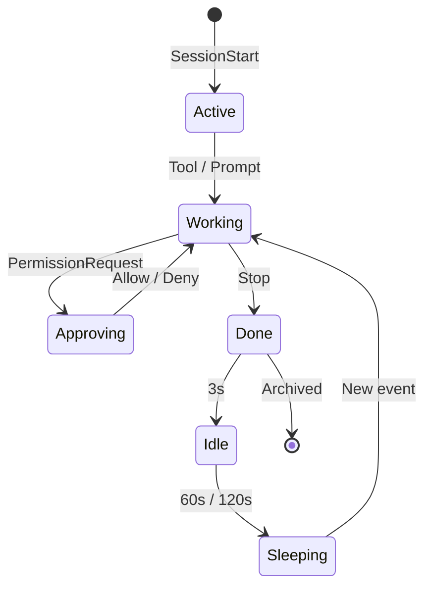

<p align="center">
  
</p>

<h1 align="center">Notchikko</h1>

<p align="center"><em>An island creature: every look upward, a quiet tenderness.</em></p>

<p align="center">
  <strong>English</strong> ·
  <a href="README.zh-CN.md">简体中文</a> ·
  <a href="README.zh-TW.md">繁體中文</a> ·
  <a href="README.ja.md">日本語</a> ·
  <a href="README.ko.md">한국어</a>
</p>

The notch at the top of your screen has long been a dark zone to be carefully avoided. Notchikko turns it into a tiny island where Notchikko settles in — pondering when you summon an Agent, scrambling when tools are called, quietly celebrating when a task completes; and when you've been gone too long, it tucks in its tail and dozes off in a corner of the island. Look up, and there it is. Notchikko understands what AI Agents are doing. It sniffs out installed CLIs and asks gently — "Want to plug in their hooks?" From then on, everything flows through it: session start, tool calls, task completion, errors, pauses — every move maps to Notchikko's gestures on the island. Above the screen, life always stirs.

## Animations

Notchikko has 12 animated states — 11 driven by hook events, 1 by a direct mouse interaction. Each state can include multiple SVG variants, picked at random on entry; the table below shows each state's trigger and a sample form. Brush your mouse across it and a bashful blush blooms up, the trackpad thrums with a heartbeat, and an `×N` combo counter drifts past the notch's edge; tug it gently and it wobbles dizzily around this little world, stars dancing over its eyes.

<table>
  <tr>
    <td align="center" width="120"><br><sub><b>Idle</b></sub><br><sub>No activity</sub></td>
    <td align="center" width="120"><br><sub><b>Reading</b></sub><br><sub>Read / Grep / Glob</sub></td>
    <td align="center" width="120"><br><sub><b>Typing</b></sub><br><sub>Edit / Write / NotebookEdit</sub></td>
    <td align="center" width="120"><br><sub><b>Building</b></sub><br><sub>Bash</sub></td>
    <td align="center" width="120"><br><sub><b>Thinking</b></sub><br><sub>LLM generating</sub></td>
  </tr>
  <tr>
    <td align="center" width="120"><br><sub><b>Sweeping</b></sub><br><sub>Context compaction</sub></td>
    <td align="center" width="120"><br><sub><b>Happy</b></sub><br><sub>Task complete</sub></td>
    <td align="center" width="120"><br><sub><b>Error</b></sub><br><sub>Tool error</sub></td>
    <td align="center" width="120"><br><sub><b>Sleeping</b></sub><br><sub>Long idle</sub></td>
    <td align="center" width="120"><br><sub><b>Approving</b></sub><br><sub>PermissionRequest</sub></td>
  </tr>
  <tr>
    <td align="center" width="120"><br><sub><b>Dragging</b></sub><br><sub>User drag</sub></td>
    <td align="center" width="120"><br><sub><b>Petting</b></sub><br><sub>Mouse rub</sub></td>
    <td align="center" width="120"><sub><b>???</b></sub><br><sub>A secret easter egg — find it yourself</sub></td>
    <td align="center" width="120"><sub><b>Coming soon</b></sub><br><sub>More interactions...</sub></td>
    <td align="center" width="120"></td>
  </tr>
</table>

## Session Behavior

Each agent session enters Notchikko's view via `SessionStart`, flows through tool calls, thinking, approval, errors, and completion, and is finally archived by `Stop`; idle and sleep are taken over by timers.
Notchikko mounts up to 32 sessions concurrently, shared across agents, with LRU eviction beyond that. Click Notchikko to focus the terminal of the current session; right-click to pin, jump, or close any session. Token usage is shown in the menu bar.

When the Agent issues a `PermissionRequest`, an approval bubble floats out from beneath the notch with four actions:

- **Allow Once**: approves just this one call — the Agent will stop to ask again next time. Good for one-off destructive ops.
- **Always Allow**: approves this call AND writes the tool into the current project's `settings.local.json` (via the hook's `addRules`), so the same tool never needs to ask again in this project. Persists across sessions.
- **Auto Approve (this session)**: switches the current session into `bypassPermissions` mode (equivalent to `--dangerously-skip-permissions`) and simultaneously releases every other pending approval for this session. Applies until the session ends.
- **Deny**: rejects the request, returning "Denied by Notchikko" as the reason to the Agent.

Claude Code's `AskUserQuestion` (the Agent asking you to pick from a few options rather than requesting permission) flows through the same approval bubble, but instead of allow/deny buttons, Notchikko renders the choices as clickable chips — tap one and the answer is relayed verbatim back to the Agent so it can keep going.

The full lifecycle:



## Support & Limitations

The table below merges CLI integration with terminal focus precision: the CLI decides whether Hook / approval / jump / Token are available, while the terminal decides whether a jump lands on a tab, a window, or simply activates the app.

<table>
  <thead>
    <tr>
      <th align="left">Component</th>
      <th align="center">Hook</th>
      <th align="center">Approval</th>
      <th align="center">Jump</th>
      <th align="center">Token</th>
      <th align="center">Focus</th>
      <th align="left">Status</th>
    </tr>
  </thead>
  <tbody>
    <tr><td colspan="7"><sub><b>CLI</b></sub></td></tr>
    <tr><td><b>Claude Code</b></td><td align="center">✓</td><td align="center">✓</td><td align="center">✓</td><td align="center">✓</td><td align="center">—</td><td>Full</td></tr>
    <tr><td><b>OpenAI Codex CLI</b></td><td align="center">✓</td><td align="center">✓</td><td align="center">✓</td><td align="center">—</td><td align="center">—</td><td>Full</td></tr>
    <tr><td><b>Gemini CLI</b></td><td align="center">✓</td><td align="center">✓</td><td align="center">✓</td><td align="center">—</td><td align="center">—</td><td>Full</td></tr>
    <tr><td><b>Trae CLI</b></td><td align="center">✓</td><td align="center">✓</td><td align="center">✓</td><td align="center">—</td><td align="center">—</td><td>Full</td></tr>
    <tr><td>Cursor Agent</td><td align="center">—</td><td align="center">—</td><td align="center">—</td><td align="center">—</td><td align="center">—</td><td>Planned</td></tr>
    <tr><td>GitHub Copilot CLI</td><td align="center">—</td><td align="center">—</td><td align="center">—</td><td align="center">—</td><td align="center">—</td><td>Planned</td></tr>
    <tr><td>opencode</td><td align="center">—</td><td align="center">—</td><td align="center">—</td><td align="center">—</td><td align="center">—</td><td>Planned</td></tr>
    <tr><td colspan="7"><sub><b>Terminal</b></sub></td></tr>
    <tr><td>iTerm2</td><td colspan="4" align="center">—</td><td align="center">Tab</td><td></td></tr>
    <tr><td>Terminal.app</td><td colspan="4" align="center">—</td><td align="center">Tab</td><td></td></tr>
    <tr><td>Ghostty</td><td colspan="4" align="center">—</td><td align="center">Tab</td><td></td></tr>
    <tr><td>Kitty</td><td colspan="4" align="center">—</td><td align="center">Window</td><td></td></tr>
    <tr><td>VS Code / VS Code Insiders / Cursor / Windsurf</td><td colspan="4" align="center">—</td><td align="center">Tab</td><td></td></tr>
    <tr><td>Other terminals</td><td colspan="4" align="center">—</td><td align="center">App</td><td></td></tr>
  </tbody>
</table>

> ✓ supported, — not applicable or not yet covered.
> Token usage is currently only readable from Claude Code's transcript; other agents will be picked up once they expose comparable fields.
> Focus precision: "Tab" = precise to the terminal tab, "Window" = to the window, "App" = just activates the app.

## Install & Run

Notchikko requires macOS 14.0 or later.

### Download

Get the latest signed and notarized `.dmg` from [Releases](https://github.com/yangjie-layer/Notchikko/releases), drag it to `/Applications`, and launch. On first run, Notchikko detects installed AI CLIs and offers to install hooks as needed.

### Build from source

Requires Xcode 15+ and Swift 5; the external dependency [Sparkle](https://github.com/sparkle-project/Sparkle) is bundled via SPM.

```bash
git clone https://github.com/yangjie-layer/Notchikko.git
cd Notchikko
xcodebuild -scheme Notchikko -configuration Debug build
```

Or open `Notchikko.xcodeproj` in Xcode and run the `Notchikko` scheme directly.

## Custom Themes

Notchikko allows the built-in character to be fully replaced. Drop a set of SVGs into `~/.notchikko/themes/<your-theme>/`, organized by state:

```
~/.notchikko/themes/my-theme/
├── theme.json
├── idle/idle.svg
├── reading/reading.svg
├── typing/typing.svg
├── ...
└── sounds/        # optional: short audio per state
```

Each state directory may hold multiple variants — Notchikko picks one at random on each entry. External SVGs are sanitized (`<script>`, `javascript:`, and similar dangerous content are stripped), capped at 1 MB per file.

## Acknowledgments & License

**The Clawd character is the property of [Anthropic](https://www.anthropic.com).** This is an unofficial project, not affiliated with Anthropic. Auto-update is powered by [Sparkle](https://github.com/sparkle-project/Sparkle).

Source code is released under the MIT license — see [LICENSE](LICENSE). Artwork in `assets/` and `Notchikko/Resources/themes/` is **not covered by MIT** — please don't redistribute it without permission.
