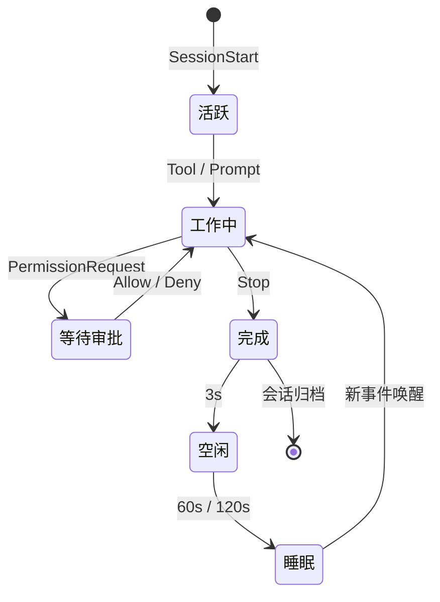

<p align="center">
  
</p>

<h1 align="center">Notchikko</h1>

<p align="center"><em>岛上生物：抬头皆是柔情出处。</em></p>

<p align="center">
  <a href="README.md">English</a> ·
  <strong>简体中文</strong> ·
  <a href="README.zh-TW.md">繁體中文</a> ·
  <a href="README.ja.md">日本語</a> ·
  <a href="README.ko.md">한국어</a>
</p>

屏幕顶端的 Notch 区域，长久以来不过是一块需要小心避让的暗色禁区。Notchikko（诺奇可）却将它化作一座微型岛屿，让 Notchikko 在此安家落户 —— 它会在你唤起 Agent 时凝神沉思，在工具被调用时伏案飞转，在任务完成时悄然雀跃；而当你久未归来，它便收起尾巴，在岛屿一角安静地打起盹来。抬眼，它便在那里。Notchikko 听得懂 AI Agent 在做什么。它会嗅探已安装的 CLI，轻声问你一句 ——"要替它们接上电话（Hook）吗？" 此后一切由它传递：会话开启、工具调用、任务完成、报错或挂起，每一种动静都会映射为岛上 Notchikko 的一举一动。屏幕之上，始终有生机。

## 动画状态

Notchikko 共有 12 种动画状态 —— 其中 11 种由 hook 事件驱动，1 种由鼠标交互触发。每种状态可包含多张 SVG 变体，进入时随机抽选 —— 下表列出每种状态的触发来源与示例形象。以鼠标轻拂而过，它便悄然晕染出一抹羞怯的绯红，触控板随之心跳般轻颤，连击计数 ×N 自 Notch 边缘缓缓掠过；若将它轻轻拖拽，它便眼冒金星，晕乎乎地晃悠在这片小小天地间。

<table>
  <tr>
    <td align="center" width="120"><br><sub><b>空闲</b></sub><br><sub>无活动</sub></td>
    <td align="center" width="120"><br><sub><b>阅读</b></sub><br><sub>Read / Grep / Glob</sub></td>
    <td align="center" width="120"><br><sub><b>输入</b></sub><br><sub>Edit / Write / NotebookEdit</sub></td>
    <td align="center" width="120"><br><sub><b>构建</b></sub><br><sub>Bash</sub></td>
    <td align="center" width="120"><br><sub><b>思考</b></sub><br><sub>LLM 生成中</sub></td>
  </tr>
  <tr>
    <td align="center" width="120"><br><sub><b>清扫</b></sub><br><sub>上下文压缩</sub></td>
    <td align="center" width="120"><br><sub><b>开心</b></sub><br><sub>任务完成</sub></td>
    <td align="center" width="120"><br><sub><b>出错</b></sub><br><sub>工具报错</sub></td>
    <td align="center" width="120"><br><sub><b>睡眠</b></sub><br><sub>长时空闲</sub></td>
    <td align="center" width="120"><br><sub><b>审批</b></sub><br><sub>PermissionRequest</sub></td>
  </tr>
  <tr>
    <td align="center" width="120"><br><sub><b>拖拽</b></sub><br><sub>用户拖动</sub></td>
    <td align="center" width="120"><br><sub><b>抚摸</b></sub><br><sub>鼠标来回撸</sub></td>
    <td align="center" width="120"><sub><b>???</b></sub><br><sub>神秘彩蛋 — 留给你自己发现</sub></td>
    <td align="center" width="120"><sub><b>敬请期待</b></sub><br><sub>更多交互...</sub></td>
    <td align="center" width="120"></td>
  </tr>
</table>


## 会话行为

每一个 Agent 会话从 `SessionStart` 进入 Notchikko 的视野，在工具调用、思考、审批、报错、完成之间流转，最终由 `Stop` 事件归档；空闲与睡眠由计时器接管。
Notchikko 同时最多挂载 32 个会话，跨 agent 共享，超出按 LRU 淘汰。点击 Notchikko 聚焦当前会话所在的终端，右键菜单可固定、跳转或关闭任意会话；token 用量同步显示在菜单栏。

当 Agent 发来 `PermissionRequest`，notch 下方会飘出一张审批气泡，承载四种动作：

- **本次允许**：只放行这一次调用，Agent 下次再想动手仍会停下来问你，适合一次性的破坏性操作。
- **永远允许**：放行本次，并把该工具写入当前项目的 `settings.local.json`（通过 hook 的 `addRules`），从此在这个项目里调用同一工具都无需再问，跨会话生效。
- **本会话自动批准**：把当前会话切到 `bypassPermissions` 模式（等价于 `--dangerously-skip-permissions`），同时把这个会话里其他积压的待审批一并放行；自此它可以随意动手，直到会话结束便失效。
- **拒绝**：驳回本次请求，并附上「Denied by Notchikko」作为原因返回给 Agent。

Claude Code 独有的 `AskUserQuestion`也会走审批气泡的同一条通道，但不会渲染成允许/拒绝按钮 —— Notchikko 把候选项直接变成可点选的胶囊，点一下便把答案原样回传给 Agent，让它继续往下走。

整个生命周期大致如下：



## 支持与限制

下面这张表把 CLI 的集成程度与终端的聚焦粒度合到一起：CLI 决定 Hook/审批/跳转/Token 是否可用，终端决定跳转时能精确到标签页、窗口还是仅激活应用。

<table>
  <thead>
    <tr>
      <th align="left">组件</th>
      <th align="center">Hook</th>
      <th align="center">审批</th>
      <th align="center">跳转</th>
      <th align="center">Token</th>
      <th align="center">聚焦精度</th>
      <th align="left">状态</th>
    </tr>
  </thead>
  <tbody>
    <tr><td colspan="7"><sub><b>CLI</b></sub></td></tr>
    <tr><td><b>Claude Code</b></td><td align="center">✓</td><td align="center">✓</td><td align="center">✓</td><td align="center">✓</td><td align="center">—</td><td>完整支持</td></tr>
    <tr><td><b>OpenAI Codex CLI</b></td><td align="center">✓</td><td align="center">✓</td><td align="center">✓</td><td align="center">—</td><td align="center">—</td><td>完整支持</td></tr>
    <tr><td><b>Gemini CLI</b></td><td align="center">✓</td><td align="center">✓</td><td align="center">✓</td><td align="center">—</td><td align="center">—</td><td>完整支持</td></tr>
    <tr><td><b>Trae CLI</b></td><td align="center">✓</td><td align="center">✓</td><td align="center">✓</td><td align="center">—</td><td align="center">—</td><td>完整支持</td></tr>
    <tr><td>Cursor Agent</td><td align="center">—</td><td align="center">—</td><td align="center">—</td><td align="center">—</td><td align="center">—</td><td>计划中</td></tr>
    <tr><td>GitHub Copilot CLI</td><td align="center">—</td><td align="center">—</td><td align="center">—</td><td align="center">—</td><td align="center">—</td><td>计划中</td></tr>
    <tr><td>opencode</td><td align="center">—</td><td align="center">—</td><td align="center">—</td><td align="center">—</td><td align="center">—</td><td>计划中</td></tr>
    <tr><td colspan="7"><sub><b>终端</b></sub></td></tr>
    <tr><td>iTerm2</td><td colspan="4" align="center">—</td><td align="center">Tab</td><td></td></tr>
    <tr><td>Terminal.app</td><td colspan="4" align="center">—</td><td align="center">Tab</td><td></td></tr>
    <tr><td>Ghostty</td><td colspan="4" align="center">—</td><td align="center">Tab</td><td></td></tr>
    <tr><td>Kitty</td><td colspan="4" align="center">—</td><td align="center">Window</td><td></td></tr>
    <tr><td>VS Code / VS Code Insiders / Cursor / Windsurf</td><td colspan="4" align="center">—</td><td align="center">Tab</td><td></td></tr>
    <tr><td>其他终端</td><td colspan="4" align="center">—</td><td align="center">App</td><td></td></tr>
  </tbody>
</table>

> ✓ 表示已支持，— 表示不适用或尚未覆盖。
> Token 用量目前只能从 Claude Code 的 transcript 中读取，其他 agent 后会跟进。
> 聚焦精度「Tab」= 精确到终端标签页，「Window」= 精确到窗口，「App」= 仅激活应用本身。

## 安装与运行

Notchikko 需要 macOS 14.0 及以上。

### 安装包下载

前往 [Releases](https://github.com/yangjie-layer/Notchikko/releases) 下载最新已签名并公证的 `.dmg`，拖入 `/Applications` 后启动。首次运行会自动检测已安装的 AI CLI，并按需引导安装 hook。

### 本地编译

依赖：Xcode 15 及以上、Swift 5；外部依赖 [Sparkle](https://github.com/sparkle-project/Sparkle) 已通过 SPM 引入。

```bash
git clone https://github.com/yangjie-layer/Notchikko.git
cd Notchikko
xcodebuild -scheme Notchikko -configuration Debug build
```

也可在 Xcode 中打开 `Notchikko.xcodeproj`，选择 `Notchikko` scheme 直接运行。

## 自定义主题

Notchikko 支持把内置角色完全替换。把一套 SVG 按状态分目录放进 `~/.notchikko/themes/<你的主题>/`：

```
~/.notchikko/themes/my-theme/
├── theme.json
├── idle/idle.svg
├── reading/reading.svg
├── typing/typing.svg
├── ...
└── sounds/ # 可选：每个状态的短音效
```

每个状态目录里能放多个变体，Notchikko 会在每次进入时随机挑一张。外部 SVG 会被自动清洗（`<script>`、`javascript:` 等危险内容会被剥掉），单文件不超过 1 MB。

## 致谢与许可

**Clawd 角色设计归属 [Anthropic](https://www.anthropic.com)。** 本项目为非官方作品，与 Anthropic 无关联；自动更新依赖 [Sparkle](https://github.com/sparkle-project/Sparkle)。

源码以 MIT 许可发布，详见 [LICENSE](LICENSE)。`assets/` 与 `Notchikko/Resources/themes/` 下的**美术素材不适用 MIT 许可**，未经允许请勿分发。
