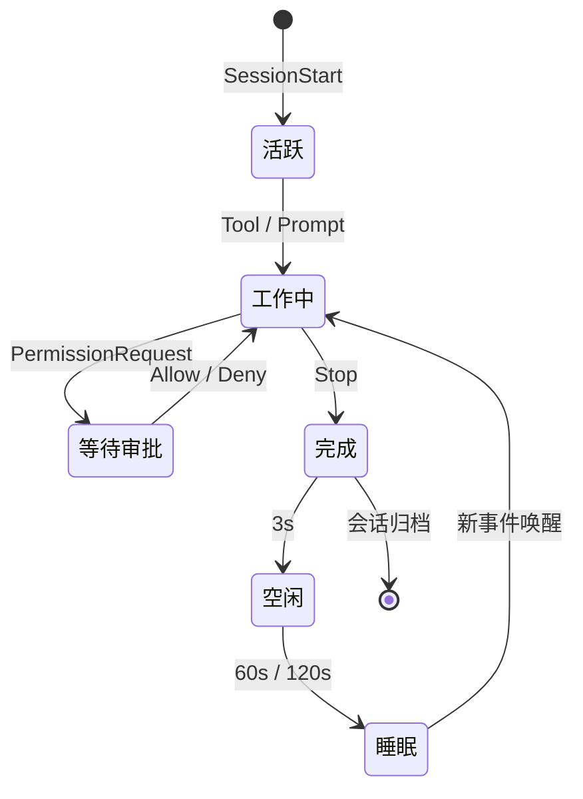

<p align="center">
  
</p>

<h1 align="center">Notchikko</h1>

<p align="center"><em>岛上生物：抬头皆是柔情出处。</em></p>

<p align="center">
  <a href="README.md">English</a> ·
  <strong>简体中文</strong> ·
  <a href="README.zh-TW.md">繁體中文</a> ·
  <a href="README.ja.md">日本語</a> ·
  <a href="README.ko.md">한국어</a>
</p>

屏幕顶端的 Notch 区域，长久以来不过是一块需要小心避让的暗色禁区。Notchikko 却将它化作一座微型岛屿，让一只小生灵在此安家落户 —— 它会在你唤起 Agent 时凝神沉思，在工具被调用时伏案飞转，在任务完成时悄然雀跃；而当你久未归来，它便收起尾巴，在岛屿一角安静地打起盹来。抬眼，它便在那里。

Notchikko 听得懂 AI Agent 在做什么。它会嗅探已安装的 CLI，轻声问你一句 ——"要替它们接上电话（Hook）吗？" 此后一切由它传递：会话开启、工具调用、任务完成、报错或挂起，每一种动静都会映射为岛上那只小生灵的一举一动。屏幕之上，始终有生机。

## 动画状态

Notchikko 通过 hook 事件实时驱动 11 种状态切换。每种状态可包含多张 SVG 变体，进入时随机抽选 —— 下表列出每种状态的触发来源与示例形象。

<table>
  <tr>
    <td align="center" width="120"><br><sub><b>空闲</b></sub><br><sub>无活动</sub></td>
    <td align="center" width="120"><br><sub><b>阅读</b></sub><br><sub>Read / Grep / Glob</sub></td>
    <td align="center" width="120"><br><sub><b>输入</b></sub><br><sub>Edit / Write / NotebookEdit</sub></td>
    <td align="center" width="120"><br><sub><b>构建</b></sub><br><sub>Bash</sub></td>
  </tr>
  <tr>
    <td align="center" width="120"><br><sub><b>思考</b></sub><br><sub>LLM 生成中</sub></td>
    <td align="center" width="120"><br><sub><b>清扫</b></sub><br><sub>上下文压缩</sub></td>
    <td align="center" width="120"><br><sub><b>开心</b></sub><br><sub>任务完成</sub></td>
    <td align="center" width="120"><br><sub><b>出错</b></sub><br><sub>工具报错</sub></td>
  </tr>
  <tr>
    <td align="center" width="120"><br><sub><b>睡眠</b></sub><br><sub>长时空闲</sub></td>
    <td align="center" width="120"><br><sub><b>审批</b></sub><br><sub>PermissionRequest</sub></td>
    <td align="center" width="120"><br><sub><b>拖拽</b></sub><br><sub>用户拖动</sub></td>
    <td align="center" width="120"><sub>更多变体藏在主题包内</sub></td>
  </tr>
</table>

## 会话行为

每一个 agent 会话从 `SessionStart` 进入 Notchikko 的视野，在工具调用、思考、审批、报错、完成之间流转，最终由 `Stop` 事件归档；空闲与睡眠由计时器接管。整个生命周期大致如下：



审批气泡承载四种动作：本次允许、永远允许、本会话自动批准、拒绝；Claude Code 的 `AskUserQuestion` 会被识别并渲染为可点选的选项。

Notchikko 同时最多挂载 32 个会话，跨 agent 共享，超出按 LRU 淘汰。点击小生灵聚焦当前会话所在的终端，右键菜单可固定、跳转或关闭任意会话；token 用量同步显示在菜单栏。

## 支持与限制

### CLI 支持

| CLI | Hook 集成 | 审批气泡 | 终端跳转 | Token 用量 | 状态 |
| --- | :---: | :---: | :---: | :---: | --- |
| **Claude Code** | ✓ | ✓ | ✓ | ✓ | 完整支持 |
| **OpenAI Codex CLI** | ✓ | ✓ | ✓ | — | 完整支持 |
| **Gemini CLI** | ✓ | ✓ | ✓ | — | 完整支持 |
| **Trae CLI** | ✓ | ✓ | ✓ | — | 完整支持 |
| Cursor Agent | — | — | — | — | 计划中 |
| GitHub Copilot CLI | — | — | — | — | 计划中 |
| opencode | — | — | — | — | 计划中 |

✓ 表示已支持，— 表示尚未覆盖。Token 用量目前只能从 Claude Code 的 transcript 中读取，其他 agent 等它们自己暴露同等字段后会跟进。

### 终端聚焦

| 终端 | 聚焦精度 |
| --- | --- |
| iTerm2 | Tab |
| Terminal.app | Tab |
| Ghostty | Tab |
| Kitty | Window |
| VS Code | Tab |
| VS Code Insiders | Tab |
| Cursor | Tab |
| Windsurf | Tab |
| 其他终端 | 应用 |

## 安装与运行

Notchikko 需要 macOS 14.0 及以上。

### 安装包下载

前往 [Releases](https://github.com/yangjie-layer/Notchikko/releases) 下载最新已签名并公证的 `.dmg`，拖入 `/Applications` 后启动。首次运行会自动检测已安装的 AI CLI，并按需引导安装 hook。

### 本地编译

依赖：Xcode 15 及以上、Swift 5；外部依赖 [Sparkle](https://github.com/sparkle-project/Sparkle) 已通过 SPM 引入。

```bash
git clone https://github.com/yangjie-layer/Notchikko.git
cd Notchikko
xcodebuild -scheme Notchikko -configuration Debug build
```

也可在 Xcode 中打开 `Notchikko.xcodeproj`，选择 `Notchikko` scheme 直接运行。

## 自定义主题

Notchikko 支持把内置角色完全替换。把一套 SVG 按状态分目录放进 `~/.notchikko/themes/<你的主题>/`：

```
~/.notchikko/themes/my-theme/
├── theme.json
├── idle/idle.svg
├── reading/reading.svg
├── typing/typing.svg
├── ...
└── sounds/        # 可选：每个状态的短音效
```

每个状态目录里能放多个变体，Notchikko 会在每次进入时随机挑一张。外部 SVG 会被自动清洗（`<script>`、`javascript:` 等危险内容会被剥掉），单文件不超过 1 MB。

## 致谢与许可

**Clawd 角色设计归属 [Anthropic](https://www.anthropic.com)。** 本项目为非官方作品，与 Anthropic 无关联。自动更新依赖 [Sparkle](https://github.com/sparkle-project/Sparkle)。

源码以 MIT 许可发布，详见 [LICENSE](LICENSE)。`assets/` 与 `Notchikko/Resources/themes/` 下的**美术素材不适用 MIT 许可**，未经允许请勿分发。
