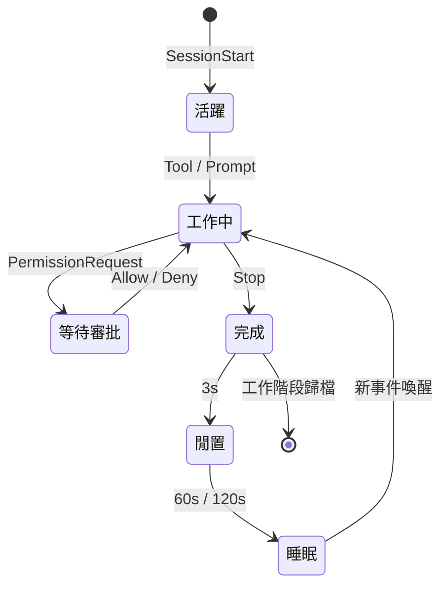

<p align="center">
  
</p>

<h1 align="center">Notchikko</h1>

<p align="center"><em>島上生物：抬頭皆是柔情出處。</em></p>

<p align="center">
  <a href="README.md">English</a> ·
  <a href="README.zh-CN.md">简体中文</a> ·
  <strong>繁體中文</strong> ·
  <a href="README.ja.md">日本語</a> ·
  <a href="README.ko.md">한국어</a>
</p>

螢幕頂端的 Notch 區域，長久以來不過是一塊需要小心避讓的暗色禁區。Notchikko（諾奇可）卻將它化作一座微型島嶼，讓 Notchikko 在此安家落戶 —— 它會在你喚起 Agent 時凝神沉思，在工具被呼叫時伏案飛轉，在任務完成時悄然雀躍；而當你久未歸來，它便收起尾巴，在島嶼一角安靜地打起盹來。抬眼，它便在那裡。Notchikko 聽得懂 AI Agent 在做什麼。它會嗅探已安裝的 CLI，輕聲問你一句 ——「要替它們接上電話（Hook）嗎？」此後一切由它傳遞：工作階段開啟、工具呼叫、任務完成、報錯或暫停，每一種動靜都會映射為島上 Notchikko 的一舉一動。螢幕之上，始終有生機。

## 動畫狀態

Notchikko 共有 12 種動畫狀態 —— 其中 11 種由 hook 事件驅動，1 種由滑鼠互動觸發。每種狀態可包含多張 SVG 變體，進入時隨機抽選 —— 下表列出每種狀態的觸發來源與示例形象。以滑鼠輕拂而過，牠便悄然暈染出一抹羞怯的緋紅，觸控板隨之心跳般輕顫，連擊計數 ×N 自 Notch 邊緣緩緩掠過；若將牠輕輕拖曳，牠便眼冒金星，暈乎乎地晃悠在這片小小天地間。

<table>
  <tr>
    <td align="center" width="120"><br><sub><b>閒置</b></sub><br><sub>無活動</sub></td>
    <td align="center" width="120"><br><sub><b>閱讀</b></sub><br><sub>Read / Grep / Glob</sub></td>
    <td align="center" width="120"><br><sub><b>輸入</b></sub><br><sub>Edit / Write / NotebookEdit</sub></td>
    <td align="center" width="120"><br><sub><b>建置</b></sub><br><sub>Bash</sub></td>
    <td align="center" width="120"><br><sub><b>思考</b></sub><br><sub>LLM 生成中</sub></td>
  </tr>
  <tr>
    <td align="center" width="120"><br><sub><b>清掃</b></sub><br><sub>上下文壓縮</sub></td>
    <td align="center" width="120"><br><sub><b>開心</b></sub><br><sub>任務完成</sub></td>
    <td align="center" width="120"><br><sub><b>錯誤</b></sub><br><sub>工具報錯</sub></td>
    <td align="center" width="120"><br><sub><b>睡眠</b></sub><br><sub>長時閒置</sub></td>
    <td align="center" width="120"><br><sub><b>審批</b></sub><br><sub>PermissionRequest</sub></td>
  </tr>
  <tr>
    <td align="center" width="120"><br><sub><b>拖曳</b></sub><br><sub>使用者拖動</sub></td>
    <td align="center" width="120"><br><sub><b>撫摸</b></sub><br><sub>滑鼠來回撫</sub></td>
    <td align="center" width="120"><sub><b>???</b></sub><br><sub>神秘彩蛋 — 留給你自己發現</sub></td>
    <td align="center" width="120"><sub><b>敬請期待</b></sub><br><sub>更多互動…</sub></td>
    <td align="center" width="120"></td>
  </tr>
</table>

## 工作階段行為

每一個 Agent 工作階段從 `SessionStart` 進入 Notchikko 的視野，在工具呼叫、思考、審批、報錯、完成之間流轉，最終由 `Stop` 事件歸檔；閒置與睡眠由計時器接管。
Notchikko 同時最多掛載 32 個工作階段，跨 agent 共享，超出按 LRU 淘汰。點擊 Notchikko 聚焦目前工作階段所在的終端機，右鍵選單可固定、跳轉或關閉任意工作階段；token 用量同步顯示在選單列。

當 Agent 發來 `PermissionRequest`，notch 下方會飄出一張審批氣泡，承載四種動作：

- **本次允許**：只放行這一次呼叫，Agent 下次再想動手仍會停下來問你，適合一次性的破壞性操作。
- **永遠允許**：放行本次，並把該工具寫入目前專案的 `settings.local.json`（透過 hook 的 `addRules`），從此在這個專案裡呼叫同一工具都無需再問，跨工作階段生效。
- **本工作階段自動核准**：把目前工作階段切到 `bypassPermissions` 模式（等同於 `--dangerously-skip-permissions`），同時把這個工作階段裡其他積壓的待審批一併放行；自此它可以隨意動手，直到工作階段結束便失效。
- **拒絕**：駁回本次請求，並附上「Denied by Notchikko」作為原因回傳給 Agent。

Claude Code 獨有的 `AskUserQuestion` 也會走審批氣泡的同一條通道，但不會渲染成允許/拒絕按鈕 —— Notchikko 把候選項直接變成可點選的膠囊，點一下便把答案原樣回傳給 Agent，讓牠繼續往下走。

整個生命週期大致如下：



## 支援與限制

下面這張表把 CLI 的整合程度與終端機的聚焦粒度合到一起：CLI 決定 Hook/審批/跳轉/Token 是否可用，終端機決定跳轉時能精確到分頁、視窗還是僅啟用應用程式。

<table>
  <thead>
    <tr>
      <th align="left">組件</th>
      <th align="center">Hook</th>
      <th align="center">審批</th>
      <th align="center">跳轉</th>
      <th align="center">Token</th>
      <th align="center">聚焦精度</th>
      <th align="left">狀態</th>
    </tr>
  </thead>
  <tbody>
    <tr><td colspan="7"><sub><b>CLI</b></sub></td></tr>
    <tr><td><b>Claude Code</b></td><td align="center">✓</td><td align="center">✓</td><td align="center">✓</td><td align="center">✓</td><td align="center">—</td><td>完整支援</td></tr>
    <tr><td><b>OpenAI Codex CLI</b></td><td align="center">✓</td><td align="center">✓</td><td align="center">✓</td><td align="center">—</td><td align="center">—</td><td>完整支援</td></tr>
    <tr><td><b>Gemini CLI</b></td><td align="center">✓</td><td align="center">✓</td><td align="center">✓</td><td align="center">—</td><td align="center">—</td><td>完整支援</td></tr>
    <tr><td><b>Trae CLI</b></td><td align="center">✓</td><td align="center">✓</td><td align="center">✓</td><td align="center">—</td><td align="center">—</td><td>完整支援</td></tr>
    <tr><td>Cursor Agent</td><td align="center">—</td><td align="center">—</td><td align="center">—</td><td align="center">—</td><td align="center">—</td><td>計劃中</td></tr>
    <tr><td>GitHub Copilot CLI</td><td align="center">—</td><td align="center">—</td><td align="center">—</td><td align="center">—</td><td align="center">—</td><td>計劃中</td></tr>
    <tr><td>opencode</td><td align="center">—</td><td align="center">—</td><td align="center">—</td><td align="center">—</td><td align="center">—</td><td>計劃中</td></tr>
    <tr><td colspan="7"><sub><b>終端機</b></sub></td></tr>
    <tr><td>iTerm2</td><td colspan="4" align="center">—</td><td align="center">Tab</td><td></td></tr>
    <tr><td>Terminal.app</td><td colspan="4" align="center">—</td><td align="center">Tab</td><td></td></tr>
    <tr><td>Ghostty</td><td colspan="4" align="center">—</td><td align="center">Tab</td><td></td></tr>
    <tr><td>Kitty</td><td colspan="4" align="center">—</td><td align="center">Window</td><td></td></tr>
    <tr><td>VS Code / VS Code Insiders / Cursor / Windsurf</td><td colspan="4" align="center">—</td><td align="center">Tab</td><td></td></tr>
    <tr><td>其他終端機</td><td colspan="4" align="center">—</td><td align="center">App</td><td></td></tr>
  </tbody>
</table>

> ✓ 表示已支援，— 表示不適用或尚未涵蓋。
> Token 用量目前只能從 Claude Code 的 transcript 中讀取，其他 agent 後會跟進。
> 聚焦精度「Tab」= 精確到終端機分頁，「Window」= 精確到視窗，「App」= 僅啟用應用程式本身。

## 安裝與執行

Notchikko 需要 macOS 14.0 以上。

### 安裝包下載

前往 [Releases](https://github.com/yangjie-layer/Notchikko/releases) 下載最新已簽章並公證的 `.dmg`，拖入 `/Applications` 後啟動。首次執行會自動偵測已安裝的 AI CLI，並按需引導安裝 hook。

### 本地編譯

依賴：Xcode 15 以上、Swift 5；外部相依 [Sparkle](https://github.com/sparkle-project/Sparkle) 已透過 SPM 引入。

```bash
git clone https://github.com/yangjie-layer/Notchikko.git
cd Notchikko
xcodebuild -scheme Notchikko -configuration Debug build
```

也可在 Xcode 中開啟 `Notchikko.xcodeproj`，選擇 `Notchikko` scheme 直接執行。

## 自訂主題

Notchikko 支援把內建角色完全替換。把一套 SVG 按狀態分目錄放進 `~/.notchikko/themes/<你的主題>/`：

```
~/.notchikko/themes/my-theme/
├── theme.json
├── idle/idle.svg
├── reading/reading.svg
├── typing/typing.svg
├── ...
└── sounds/        # 選用：每個狀態的短音效
```

每個狀態目錄裡能放多個變體，Notchikko 會在每次進入時隨機挑一張。外部 SVG 會被自動清洗（`<script>`、`javascript:` 等危險內容會被剝掉），單檔不超過 1 MB。

## 致謝與授權

**Clawd 角色設計歸屬 [Anthropic](https://www.anthropic.com)。** 本專案為非官方作品，與 Anthropic 無關聯。自動更新依賴 [Sparkle](https://github.com/sparkle-project/Sparkle)。

原始碼以 MIT 授權釋出，詳見 [LICENSE](LICENSE)。`assets/` 與 `Notchikko/Resources/themes/` 下的**美術素材不適用 MIT 授權**，未經允許請勿散布。
