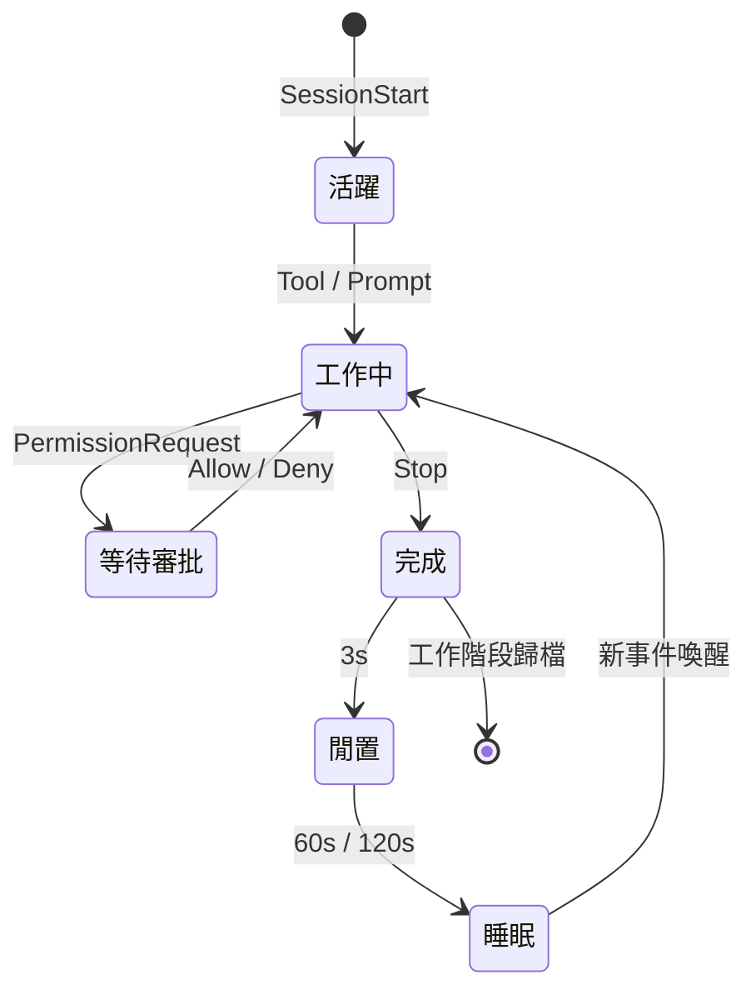

<p align="center">
  
</p>

<h1 align="center">Notchikko</h1>

<p align="center"><em>島上生物：抬頭皆是柔情出處。</em></p>

<p align="center">
  <a href="README.md">English</a> ·
  <a href="README.zh-CN.md">简体中文</a> ·
  <strong>繁體中文</strong> ·
  <a href="README.ja.md">日本語</a> ·
  <a href="README.ko.md">한국어</a>
</p>

螢幕頂端的 Notch 區域，長久以來不過是一塊需要小心避讓的暗色禁區。Notchikko 卻將它化作一座微型島嶼，讓一隻小生靈在此安家落戶 —— 它會在你喚起 Agent 時凝神沉思，在工具被呼叫時伏案飛轉，在任務完成時悄然雀躍；而當你久未歸來，它便收起尾巴，在島嶼一角安靜地打起盹來。抬眼，它便在那裡。

Notchikko 聽得懂 AI Agent 在做什麼。它會嗅探已安裝的 CLI，輕聲問你一句 ——「要替它們接上電話（Hook）嗎？」此後一切由它傳遞：工作階段開啟、工具呼叫、任務完成、報錯或暫停，每一種動靜都會映射為島上那隻小生靈的一舉一動。螢幕之上，始終有生機。

## 動畫狀態

Notchikko 透過 hook 事件即時驅動 11 種狀態切換。每種狀態可包含多張 SVG 變體，進入時隨機抽選 —— 下表列出每種狀態的觸發來源與示例形象。

<table>
  <tr>
    <td align="center" width="120"><br><sub><b>閒置</b></sub><br><sub>無活動</sub></td>
    <td align="center" width="120"><br><sub><b>閱讀</b></sub><br><sub>Read / Grep / Glob</sub></td>
    <td align="center" width="120"><br><sub><b>輸入</b></sub><br><sub>Edit / Write / NotebookEdit</sub></td>
    <td align="center" width="120"><br><sub><b>建置</b></sub><br><sub>Bash</sub></td>
  </tr>
  <tr>
    <td align="center" width="120"><br><sub><b>思考</b></sub><br><sub>LLM 生成中</sub></td>
    <td align="center" width="120"><br><sub><b>清掃</b></sub><br><sub>上下文壓縮</sub></td>
    <td align="center" width="120"><br><sub><b>開心</b></sub><br><sub>任務完成</sub></td>
    <td align="center" width="120"><br><sub><b>錯誤</b></sub><br><sub>工具報錯</sub></td>
  </tr>
  <tr>
    <td align="center" width="120"><br><sub><b>睡眠</b></sub><br><sub>長時閒置</sub></td>
    <td align="center" width="120"><br><sub><b>審批</b></sub><br><sub>PermissionRequest</sub></td>
    <td align="center" width="120"><br><sub><b>拖曳</b></sub><br><sub>使用者拖動</sub></td>
    <td align="center" width="120"><sub>更多變體藏在主題包內</sub></td>
  </tr>
</table>

## 工作階段行為

每一個 agent 工作階段從 `SessionStart` 進入 Notchikko 的視野，在工具呼叫、思考、審批、報錯、完成之間流轉，最終由 `Stop` 事件歸檔；閒置與睡眠由計時器接管。整個生命週期大致如下：



審批氣泡承載四種動作：本次允許、永遠允許、本工作階段自動核准、拒絕；Claude Code 的 `AskUserQuestion` 會被識別並渲染為可點選的選項。

Notchikko 同時最多掛載 32 個工作階段，跨 agent 共享，超出按 LRU 淘汰。點擊小生靈聚焦目前工作階段所在的終端機，右鍵選單可固定、跳轉或關閉任意工作階段；token 用量同步顯示在選單列。

## 支援與限制

### CLI 支援

| CLI | Hook 整合 | 審批氣泡 | 終端機跳轉 | Token 用量 | 狀態 |
| --- | :---: | :---: | :---: | :---: | --- |
| **Claude Code** | ✓ | ✓ | ✓ | ✓ | 完整支援 |
| **OpenAI Codex CLI** | ✓ | ✓ | ✓ | — | 完整支援 |
| **Gemini CLI** | ✓ | ✓ | ✓ | — | 完整支援 |
| **Trae CLI** | ✓ | ✓ | ✓ | — | 完整支援 |
| Cursor Agent | — | — | — | — | 計劃中 |
| GitHub Copilot CLI | — | — | — | — | 計劃中 |
| opencode | — | — | — | — | 計劃中 |

✓ 表示已支援，— 表示尚未涵蓋。Token 用量目前只能從 Claude Code 的 transcript 中讀取，其他 agent 等它們自己暴露同等欄位後會跟進。

### 終端機聚焦

| 終端機 | 聚焦精度 |
| --- | --- |
| iTerm2 | Tab |
| Terminal.app | Tab |
| Ghostty | Tab |
| Kitty | Window |
| VS Code | Tab |
| VS Code Insiders | Tab |
| Cursor | Tab |
| Windsurf | Tab |
| 其他終端機 | 應用程式 |

## 安裝與執行

Notchikko 需要 macOS 14.0 以上。

### 安裝包下載

前往 [Releases](https://github.com/yangjie-layer/Notchikko/releases) 下載最新已簽章並公證的 `.dmg`，拖入 `/Applications` 後啟動。首次執行會自動偵測已安裝的 AI CLI，並按需引導安裝 hook。

### 本地編譯

依賴：Xcode 15 以上、Swift 5；外部相依 [Sparkle](https://github.com/sparkle-project/Sparkle) 已透過 SPM 引入。

```bash
git clone https://github.com/yangjie-layer/Notchikko.git
cd Notchikko
xcodebuild -scheme Notchikko -configuration Debug build
```

也可在 Xcode 中開啟 `Notchikko.xcodeproj`，選擇 `Notchikko` scheme 直接執行。

## 自訂主題

Notchikko 支援把內建角色完全替換。把一套 SVG 按狀態分目錄放進 `~/.notchikko/themes/<你的主題>/`：

```
~/.notchikko/themes/my-theme/
├── theme.json
├── idle/idle.svg
├── reading/reading.svg
├── typing/typing.svg
├── ...
└── sounds/        # 選用：每個狀態的短音效
```

每個狀態目錄裡能放多個變體，Notchikko 會在每次進入時隨機挑一張。外部 SVG 會被自動清洗（`<script>`、`javascript:` 等危險內容會被剝掉），單檔不超過 1 MB。

## 致謝與授權

**Clawd 角色設計歸屬 [Anthropic](https://www.anthropic.com)。** 本專案為非官方作品，與 Anthropic 無關聯。自動更新依賴 [Sparkle](https://github.com/sparkle-project/Sparkle)。

原始碼以 MIT 授權釋出，詳見 [LICENSE](LICENSE)。`assets/` 與 `Notchikko/Resources/themes/` 下的**美術素材不適用 MIT 授權**，未經允許請勿散布。
